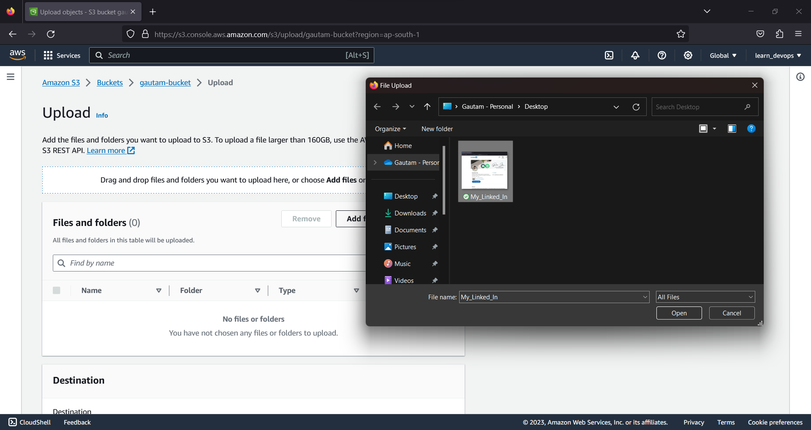
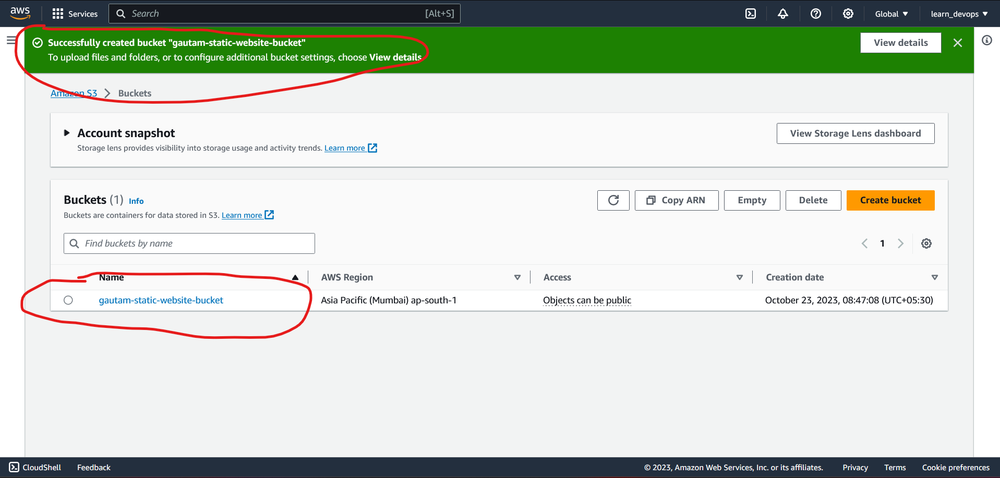

# Simple Storage Service (S3)

**What is S3 ?**  
S3 stands for simple Storage Service, and essentially It's Object storage in the cloud. 
- It provides secure, durable, and highly-scalable obect storage. 
- S3 allows us to store and retrieve any amount of data from anywhere on the web at very low cost. So it's extreamly Scalable. 
- It's really, realy simple to use. It comes with really easy-to-use web interface, 

**S3 is object based storage**  
S3 manages data as objects rather than in file systems or data blocks. basically it means S3 is a place where we can store our files. 
- We can upload any type of file in S3 
- Example include photos, videos, code, documents, and text files. 
- We can't install Operating System on S3 or cant run a database on S3. 
- S3 is ust a place to store our static files. the files that do not change. 

**S3 Basics** 
- Unlimited Storage :- The total volume of data and the number of obects we can store is unlimited. 
- Objects up to 5 Tb in size :- objects in S3 can be start with 0 bytes and go all the way up to 5 terabytes. 
- S3 Buckets :- We store our files in a thing called Bucket. It's basically a folder inside S3. So We might have bucket for our Test and Dev. Basically everywhere we store out files is in these things called Buckets. 

**Working With S3 Buckets**  
1. Universal Namespace :- All AWS accounts share the S3 namespace and for that reason, our S3 Bucket name has to be globally unique. 
2. Example S3 URLs :- ``https://bucket-name.s3.Region.amazonaws.com/key-name``
3. Uploading Files :- When we upload a file to S3, If that upload is successful, our browser will receive a HTTP 200 code.  

**Key-Value Store**  
1. Key :- Key is simply the name of the object, do if we were to upload a photo of AWS logo, The key would be *logo.jpg* 
2. Value :- Vale is the data itself, It is made up of a sequence of bytes.
3. Version Id :- This is whe we have versioning enabled on the bucket. This is imporant for storing multiple versions of the same object. 
4. Metadata :- Metadata is simply data about data. in S3 case the data about the data that we are storing could be content type, laste time the file modified, etc., etc. 

**S3 a safe place** 

S3 is a safe place to store our files. The data is always spread across multiple devices and facilities to ensure availability and durability. So it's is not on single data center in a single server, it is always spread across multiple devices an multiple facilities. 

**Highly Available and Highly Durable** 

- Built for availability :- It's built for 99.95% to 99.99% service availability depending on the S3 tier. 
- Designed for Durability :- Durability just means is our files going to be lost at some point? S3 is designed for what's called 11 9's (99.99999999%) durability for data stored in S3. 


**S3 Standard**  
standarad S3 is default version of S3, when we store our objects. 
- High Availability and Durability :- Data is sstored redundantly across multiple devices in multiple facilities ( >=3 AZs ):  
    * 99.99% availability
    * 99.999999999% durability (11 9's)  
- Designed for frequent access :- If we are frequently accessing our data may be reading or writing to it every second or even every hour or every day, that's what S3 is built for. 
- Suitable for most workloads :-
    *  S3 is default storage class 
    * it's use cases include things like websites, content distribution, mobile and gaming applications, big data analytics etc., etc. 

**Characteristics** 
- Tiered Storage :- S3 offers a range of storage classes designed for different use cases. So S3 Standrd fits most use cases, but it doesn't fit all use cases. 
- Lifecycle Management :- This is where we difine rules to automatically transistion our objects or files to a cheaper storage tier or to delete the objects that are no longer required after a set period of time. 
- Versioning :- With Versioning all versions of an object are stored in S3 and they can be retrieved, including deleted objects. 

**Securing Our Data**  
In terms of securing our data, we can secure our data in number of different ways. 
1. Server-Side Encryption :- Here we can set default encryption on a Bucket to encrypt all new objects when they are stored in the Bucket. So as soon as we upload an object to ur bucket that object will be encrypted. So if somebody breaks into AWS data center and starts stealing Hard drives, which is higly unlikely, that means they will not be able to access our objects because it would be encrypted. 
2. Access Control Lists (ACLs) :- This defines which AWS accounts or groups are granted access and the type of access that they are granted. We can attach S3 access control lists to individual objects to individual files within a Bucket. It gives us that much of a fine-grained approach. 
3. Bucket Poicies :- These are policies that are specific to what actions are allowed or denied for that particular Bucket. So we could allow Alice to put but not delete objects into a bucket. Bucket policies are bucket wide. It is simply JSOn policies, and we attach them to buckets and they will apply across the Bucket as a whole. 

**Strong Read-After-Write Consistency**  
- After a successful write :- A new object (PUT) or an overwrite of an existing object, any subsequent read request immediately receives the latest version of the object. 
- Strong consistency :- after a write, we can immediately perform a listing of the objects in a bucket with all changes reflected. 

| Access Control List  | Bucket Policy |
| ------------- | ------------- |
| Object ACLs work on an individual object level  | Bucket policies work on an entire bucket level  |


## Create a bucket
Step 1 :-


Step 2 :- Give name to bucket (name should be universally unique)


Step 3 :- Hit on create button 

 

Step 4 :- S3 bucket List 

 

## Upload objects to bucket 

Step 1 :- Click on Bucket to upload object
 

Step 2 :- Click on Upload 
 

Step 3 :- Click on add files
 

Step 4 :- Select files 
 

Step 5 :- Select Upload 
 

Step 6 :- Check for status if upload succeded
 

## Make object publically accessible 

Step 1 :- In bucket, click on permissions 
 

Step 2 :- in block public access section, click on edit
 

Step 3 :- Uncheck block public access 
 

Step 4 :- Click on save changes and then type confirm then click confirm
 

Step 5 :- Again go to bucket permission and click on Edit Object ownership 


Step 6 :- Click on ACL enabled and click on checklist (I acknowledge that ACL will be restored) 


Step 7 :- Save Changes 


Step 8 :- Go to bucket and click the checklist of object that you want to make public 


Step 9 :- Go to action and click make public using ACL


Step 10 :- Click Make Public 


## Access the public file of S3
``https://bucket-name.s3.Region.amazonaws.com/key-name``  


``https://gautam-bucket.s3.ap-south-1.amazonaws.com/My_Linked_In.png``  


## Host Static Website using S3

We can use S3 to host Static Websites, wuch as .html sites. 

Dynamic websites, such as those that require database connections cannot be hosted on S3. 

**S3 Scales Automatically**  
To meet demand S3 scales automatically, many enterprises will put static websites on S3 when they think there is going to be a large number of requests (e.g., for a moview preview). 


**Let's Create a new bucket for Hosting Static Content.**

Step 1 :- Create a bucket with allowing public access


Step 2 :- Go to properties of bucket and scroll down to static website hosting and click on Edit


Step 3 :- Enable Static website hosting 


Step 3 :- below that enter index.html file name and error.html file name and click save changes


Step 4 :- Upload the static files


Step 5 :- Make entire bucket public using Bucket policy, Go to permissions of bucket.


Step 6 :- Go to edit Bucket policy and copy this json and paste it there 
```json 
{
    "Version": "2012-10-17",
    "Statement" : [
        {
            "Sid": "PublicReadGetObject",
            "Effect": "Allow",
            "Principal": "*",
            "Action": [
                "s3:GetObject"
            ],
            "Resource": [
                "arn:aws:s3:::BUCKET_NAME/*"
            ]
        }
    ]
}
```


**[NOTE]** Do not foget to update the resource arn.

Step 7 :- Click on save changes  


To access the website go to properties of bucket and in static website hosting section click on the URL to access the website. 


Here is the website 


