# Identity and Access Management (IAM)  

IAM allows us to manage users and their level of access to the AWS console. 
- Create users and grant permissions to those users.
- Create groups and roles.
- Control access to AWS resources. 

## What is Root Account ?
The root account is the email address we used to sign up for AWS. The root account has full administrative access to AWS. For this reason, it is impotant to secure the root account. 

**Some steps we can do to secure Root Account**  
1. Use MFA (multi Factor Authentication)  
2. Create an admin group for administrators, and assign the appropriate permissions to this group.
3. Create user accounts for your administrators. 
4. Add your uers to the admin group. 

## Controlling Users' Actions with IAM Policy Documents. 

**How do we control Permissions Using IAM?**  
We assign permissions using policy documents, which are made up of JSON (JavaScript Object Notation). 

**Example of Policy Document**  
```JSON
{
    "version": "2012-10-17",
    "statement": [
        {
            "Effect": "Allow",
            "Action": "*",
            "Resource": "*"
        }
    ]
}
```

In this example we ae giving Administratie access, This Example is saying Allow the action of everything on every resource. 

**We can Assign policy document to**  
1. Groups 
2. users  
3. Roles  

Typically we do not asign policy document to users, not because we can't it is just because It is difficult to manage. Instead we assign policy document to Groups and add user to that group. By this way user inherits the permissions from group. 


## The Building block of IAM

1. **Users** :- One user should always be 1 physical person. 
2. **Groups** :- We should group our user using groups, and this should be by job function. such as adminstrator, developer, HR, Finance etc. like whatever job function we have within our organization. 
3. **Roles** :- Roles are basically used for internal usage within AWS, it allows 1 part of AWS to access another part of AWS. (Roles will be explained on Day-3 EC2 day)

**IAM Policy Documents**  
It's best practice for users to inherit permissions from group, we can directly assign IAM policy to users but it will be very difficult to manage. 

## User and People Best Practices  
user = Physical Person  
Always work on the principle that one user equal one person. Never share user accounts across multiple people.  

## The principla of Least Priviledge 
Only assign a user the minimum amount of privileges they need to do their job. So your developers, you want to give them developer access, maybe full administrator access to the AWS platform. Wha you don't want to do is give that to your finance team or to your HR team. You Finance or HR team don't need to spin up Virtual machines. 


## Create a User 
Step 1 :- Go to IAM console ---> search for IAM and select IAM  
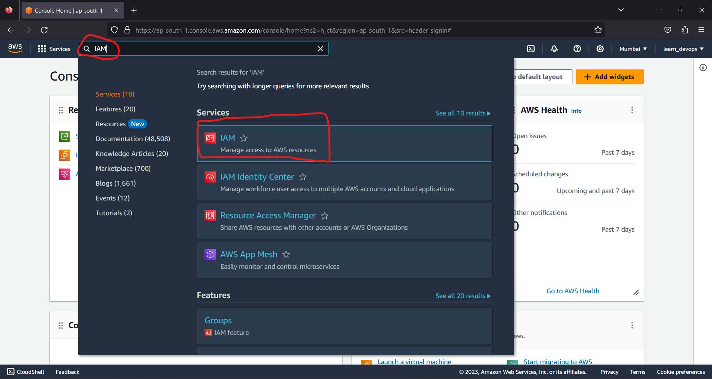

Step 2 :- In IAM Console select Users from left side navigation bar.  
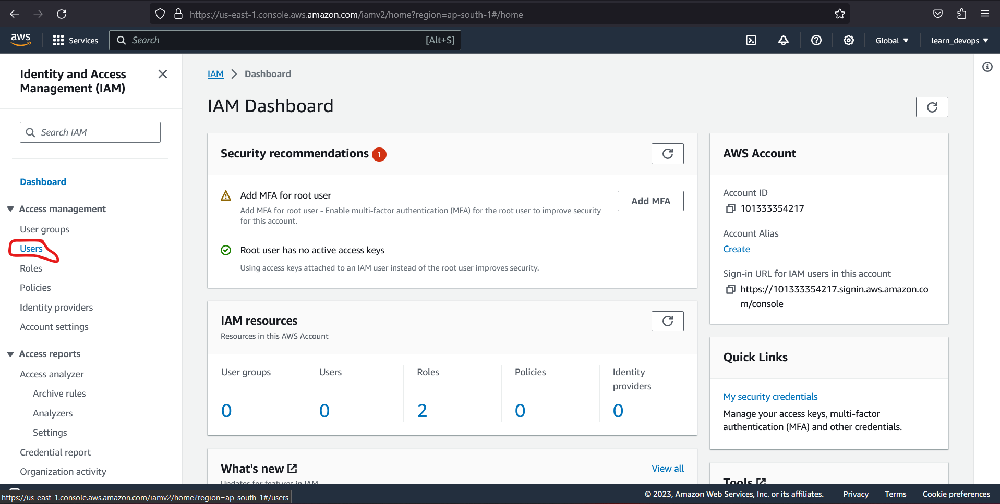

Step 3 :- click on create User 
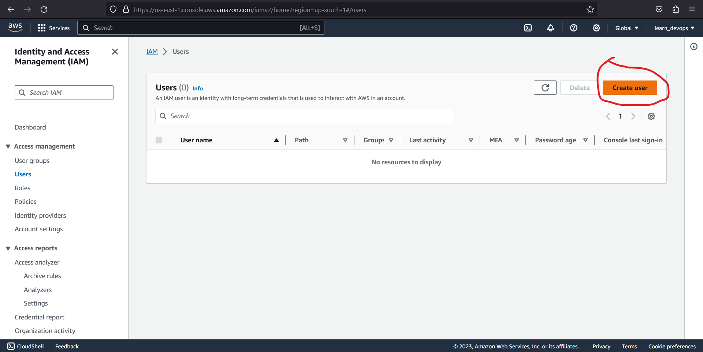

Step 4 :- Provide Username and select if want to give console access or not, and choose the other options accordingly. 
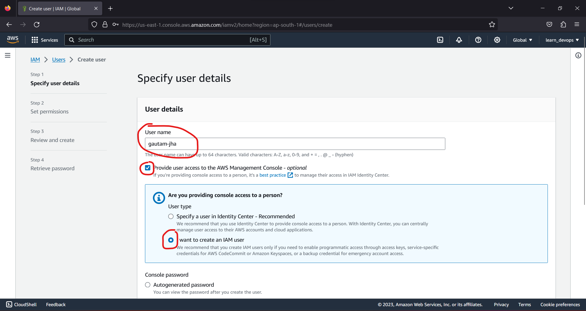  

Step 5 :- Click on Next
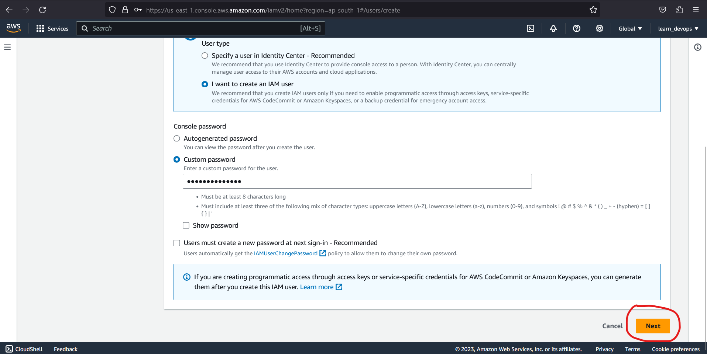  

Step 6 :- Create a Group in which user needs to be in (In my case I am creating admin group) so click on create group
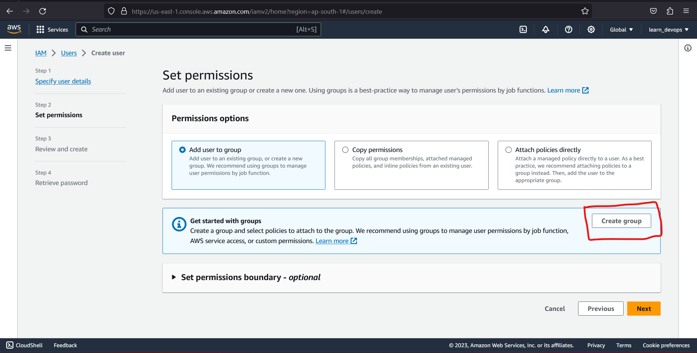  

Step 7 :- Provide group name and attach policy 
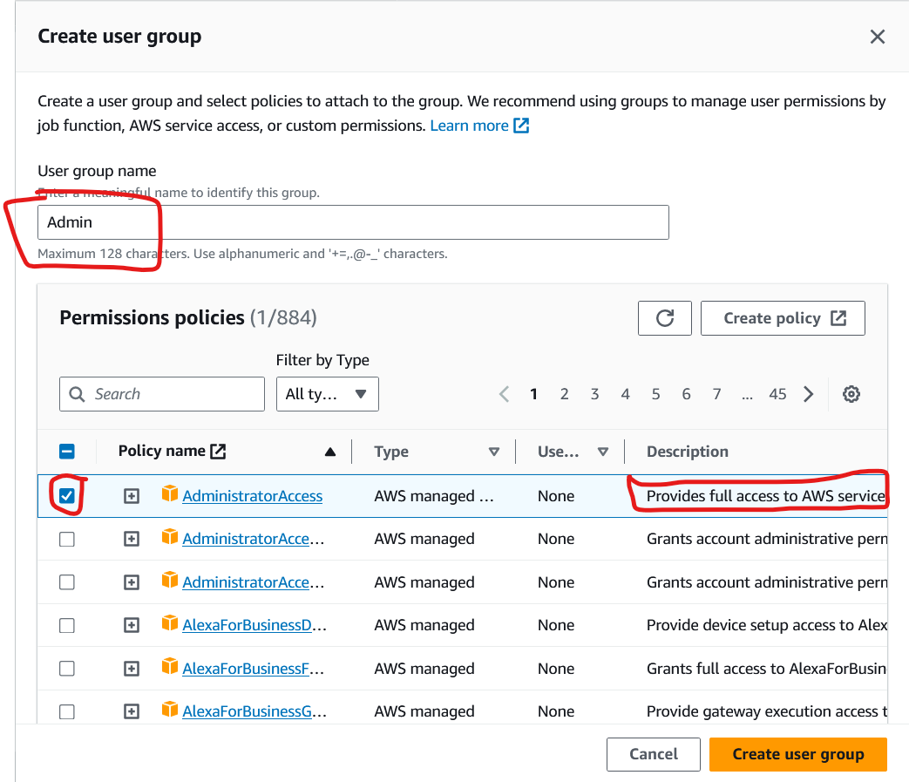 

Step 8 :- Click on Create user group. 

Step 9 :- Select the group name to add the user and click next
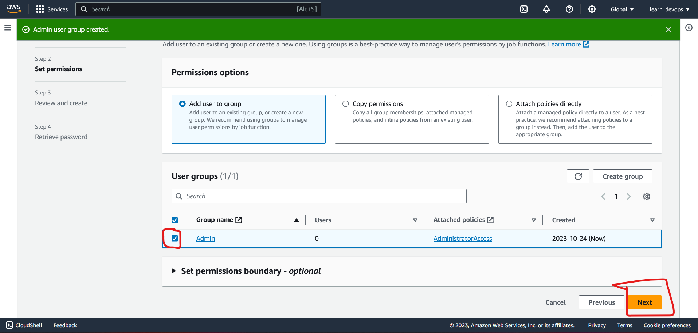 

Step 10 :- in review and create page click create user
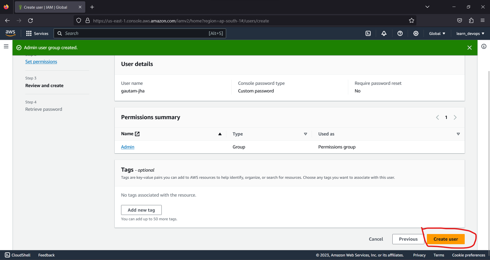 

Step 11 :- In retrieve password step Download the credential in csv file (ust to save the credentials in safe place) and click return to user list.  
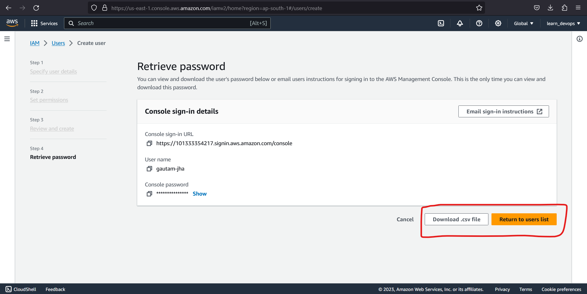 

## Enable password Policy
Step 1 :- Go to Account setting from left side navigation in IAM 
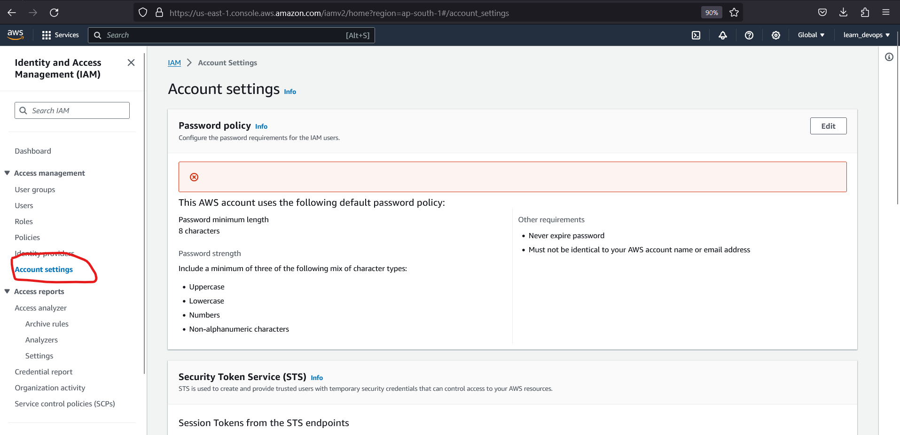 

Step 2 :- Click on edit in Password policy section  

Step 3 :- Click on Custom and check the checbox accordingly and save changes
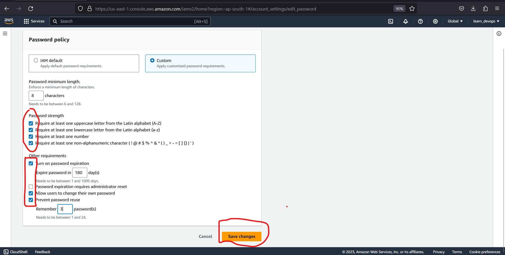 

# Summary
- IAM is Universal It does not apply to regions.
- The Root account is created when we first setup our AWS account and which has complete admin access. Secure it as soon as possible and do not use it to log in day to day. 
- New users have no permissions when first created. 
- Access key ID and Secret access keys are not same as username and passwords. 
- You only get to view these once. if you lose them you have to regenerate them. So save them in a secure location. 
- Always setup password rotations. You can create and customize your own password rotation policies. 

