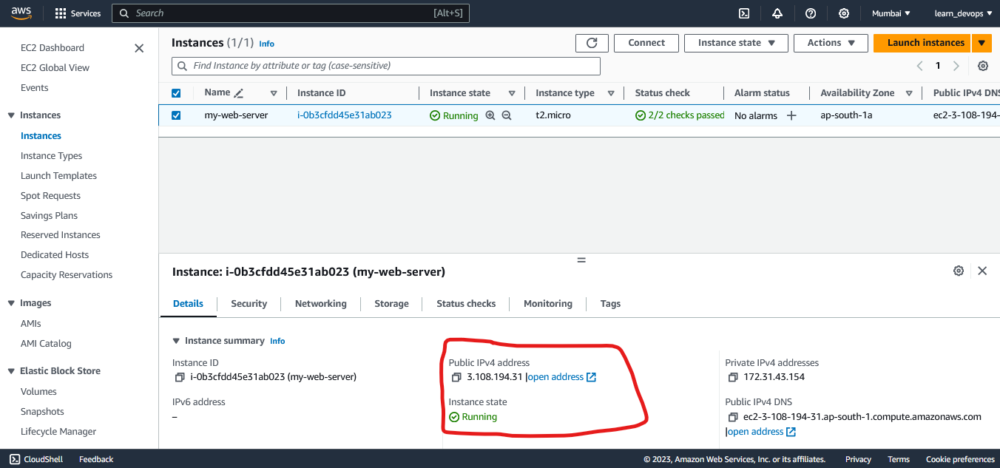

# Elastic Compute Cloud (EC2)  
EC2 is basically 
- Secure, resizable compute capacity in the cloud 
- Like a VM, only hosted in AWS instead of our own data center. 
- Designed to make web-scale cloud computing easier for developers. 
- The capacity we want when we need it. 
- We are in complete control of owr own instances. It is not managed by AWS

## Introducing EC2
- EC2 is a Game changer :- AWS led a big change in the industry by introducing EC2. 
- Pay Only for What you use :- EC2 changed the economics of computing.
- No Wasted Capacity :- Select the capacity we need right now.Grow and shrink when we need. 
- Wait Minutes for EC2, Not months like on premises server. 

## EC2 Pricing Options 
1. On-Demand :- Pay by hour or second, depending on the ttype of instance we run.
2. Reserved :- Reserved capacity for 1 or 3 ears. Up to 722% dicount on the hourly charge. 
3. Spot :- Purchase unused capacity at a discount of upto 90% Prices fluctuate with supply and Demand.
4. Dedicated :- A physical EC2 server dedicated for our use. The most expensive option. 

### On-Demand Instances 
1. Flexible :- Low cost and flexibility of Amazon EC2 without any upfront payment or long-term commitment.
2. Short-Term :- Applications with short-term, spiky, or unpredictable workloads that cannot be interrupted.
3. Testing The Water :- Applications being developed or tested on Amazon EC2 for the first time. 

### Reerved Instances 
1. Predictable Usage :- Applications with steady state or predictable usage.
2. Specific Capacity Requirements :- Applications that require reserved capacity.
3. Pay up Front :- You can make upfront payments to reduce the total computing costs even further. 
4. Standard Reserved Instances :- Up to 72% off the on-demand price.
5. Convertible Reserved Instances :- Up to 54% off the on-demand price. Has the option to change to a different Reserved Instance Typr of equal or greater value. 
6. Scheduled Reserved Instances :- Launch within the time window we define. Match our capacity reservation to a predictable recurring schedule that only requires a fraction of a day, week, or month. 

NOTE :- Reserved instances operates at rgional level, so can't change the region. 

### Spot Instances 
When to use spot instance  
1. Flexible :- Applications that have flexible start and end times. 
2. Cost Sensitive :- Applications that are only feasible at very low cmpute prices.
3. Urgent Capacity :- Users with an urgent need for large amounts of additional computing capacity. 

### Dedicated Hosts 
1. Compliance :- Regulatory requirements that may not support multi-tenant virtualization. 
2. Licensing :- Great for licensing that does not support multi-tenancy or cloud deployment 
3. On-Demand :- Can be ppurchased on-demand (hourly)
4. Reserved :- Can be purchased as a reervation for up to 70% off the on-demand price. 

## Launching An EC2 instance 
Step 1 :- Go to EC2 console  

Step 2 :- Click on Launch Instance

Step 3 :- Give name to server, Select OS, Select Instanch Type, 

Step 4 :- Create a key pair to login into that instance.   
a) Select Create new key pair
  
b) Enter Key pair name, select key pair type, and key file format. and click create key pair 
 
[NOTE] We can also select the existing key pair if already key is created  

Step 5 :- In security Group option either select the option to create new security group or select existing security group. 


Step 6 :- Add storage to the EC2 instance, we can either add new volume or increase or decrease the size of root volume.


Step 7 :- Enter the number of instances to run and click on launch instance.


In Instances section of EC2 console we will see the instance is spinning, Give it time to properly bootup.


## Connect to EC2 instance 
Step 1 :- In local machine, open terminal and run ``ssh -i <path/to/key_pair/key.pem> username@publicIp_of_server``


* We can Find public IP in details of EC2 server



## Using Roles 

**What Is an IAm Role?**
A role is an identity we can createin IAM that has specific permissions. A roleis similar to a user, as it is an AWS identity with permission policies that determine what the identity can and cannot do in AWS. 

However, instead of being uniquely associated with one person, a role is intended to be assumable by anyone who needs it. 

**Roles are Temporary**  
A role does not have standard long-term credentials the same way passwords or access keys do. Instead, when you asssume a role, it provides you with temporary security credentials for your session.  

**What Else Can Roles Do?**  
Roles can be assumed by people, AWS architecture, or other system-level accounts.  

Roles can allow cross-account access. This allows one AWS account the ability to interact with resources in other AWS accounts. 

Roles can be attached to EC2 instances and can ceate resources in our AWS account. by this way we do not have to configure AWS CLI to create any rsource with CLI.

## Create S3 with EC2 and Roles

Step 1 :- Go to IAm and select roles and then click create role


Step 2 :- Select AWS Service in trusted entity type and in use case select EC2  
  

Step 3 :- Click next and attache S3 permision. and click next


Step 4 :- Give role a name and description and click create role. 


Step 5 :- create a EC2 instance with above step.   
Step 6 :- Before lucing the instane in Instance Advanced detail section under the IAM instance profile chose the role that we created. 

Step 7 :- Click Launch Instance   
Step 8 :- Connect to EC2 instance using ``ssh -i <path/to/key_pair/key.pem> username@publicIp_of_server``  
  

Step 9 :- List AWS S3 buckets  using ``aws s3 ls``  
    * if aws is not installed on EC2 server install using ``apt-get install aws-cli``  

Step 10 :- If ``aws s3 ls`` did not show anything, probably because there is no bucket in your AWS. Create one using aws s3 mb s3://<bucket-name>


Step 11 :- Put a hello_world.txt file in s3 bucket 
- Create file using ``echo "Hello World" > hello_world.txt`` 
- Copy it to bucket using ``aws s3 cp hello_world.txt s3://gautam-bucket``


We can see it in console also.  


### We can attach or detach role on existing running instance

Step 1 :- select the instance from EC2 console instances section  
Step 2 :- Go to Actions  
Step 3 :- Click security  
Step 4 :- Modify IAM role  
Step 5 :- Seect IAM role and click on Update IAM role.   

## Security Groups  

Security groups are virtual firewall for our EC2 instance. By default, everyhing is blocked.  
- To let everything in use 0.0.0.0/0  

In order to be able to communicate to oue ec2 instance via SSH/RDP/HTTP, we will need to open up the correct ports.  

**Default Ports**  
- Linux :- SSH 22
- Windows :- RDP 3389 
- HTTP :- Web browsing 80 
- HTTPS :- Encrypted Web browsing (SSL) 443  

## Bootstrap Scripts 
A script that runs when the instance first runs, the boot strap scrip will go and start running in Bootstrap level. I has root level permissions, and it can go in and do anything.  

**Example Bootstrap Script**  
```bash 
#!/bin/bash
apt-get update -y
apt-get upgrade -y
apt-get install nginx -y
systemctl start nginx 
```  
- Adding these tasks at boot time adds to the amount of time it takes to boot the instance. However, It allows us to automate the installation of applications. 

To use bootstrap script we can go to advance detail section while launching instance section andd add the script in User data section. 

## Networking with EC2
We can attach 3 different types of virtual networking cards to our EC2 instances.  
1. ENI :- Elastic Network Interface used for basic, day to day networking. 
2. EN :- Enhanced Networking - It uses single root I/O virtualization (SR-IOV) to provide high performance.  
3. EFA :- Elastic Fabric Adapter - Accelerates High performance computing (HPC) and machine learning applcations. 

### ENI 
An ENI is simply a virtual network card that allows:  
- Private IPv4 addresses 
- Public IPv4 Addresses 
- Many IPv6 Addresses
- MAC Address 
- 1 or More Security Groups 

**Common ENI Use Cases**  
- Create a management network.
- Use network and security appliances in our VPC. 
- Create dual-homed instances with workloads/roles on distinct subnets
- Create a low-budget, hig availability solution.  

### Enhanced Networking 
For High-performance Networking between 10Gbps-100Gbps 

**Single root I/O virtualization (SR-IOV)**   
SR-IOV provides higher I/O performance and lower CPU utilization

**Performance**  
Provides higher bandwidth, higher packet per second (PPS) performance and consistently lower inter-instance latencies.  

### What is an EFA?  
Elastic Fabric Adapter 
- A network evice we can attach to our EC2 instance to accelerate High performance Computing (HPC) and machine learning applications. 
- Provides lower and more consistent latency and hiher throughput than the TCP transport traditionally used in cloud-based HPC systems. 

## Optimizing EC2 with placement group 
There are 3 types of placement group 
1. Cluster placement group  
Grouping of instances within a single Availability Zone. Recommended for application that need low network latency, high network throughput, or both. 

- Only certain instance types can be launched intoa cluster placement group.  

- They are in same AZ so they are really really close to each other. 
- It's a way to speeding up the rate at which our EC2 instances communicate. 

2. Spread placement groups   
A spread placement froup is a group of instances that are each placed on distinct underlying hardware.   

- Spread placement groups are recommended for applications that have a small number of critical instances that should be kept seperate from each other. 

3. Partition Placement groups  
Each partition placement group has its own set of racks. Each rack has it's own network and power source. No two partitions within a placement group share the same racks, allowing us to isolate the impact of hardware failure within our application.  
- EC2 divides Each group into logical segments called partitions.  


> Placement group is a way of logically grouping EC2 instance accoring to the need . 