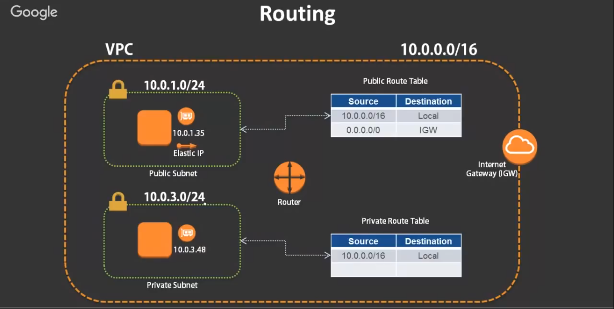

# Virtual Private Cloud (VPC)  

Isolated cloud network 
- Create user defined virtual networks (IPv4/IPv6)
- Allows control of the networking environmant
- Can be conected to existing datacenters over VPN or Direct connect
- Can be peered with other VPCs in AWS. 

## Visualize VPC  

## VPC Arrchitecture 

## Components of VPC 
1. Router :- Router routes the traffic from one place to another.
2. Route table :- When router routes the traffic it checks the route table to understand how it need to route the traffic, for example IP 10.0.0.5 need to communicate wit 10.0.0.6, Routr checks the route to take in route table and proceed accodingly. If there is no route defined we will get error something like time out. 
3. Elastic IP :- Elastic Ip is static public Ip may be assigned to EC2 instance  even if the system stops and restart again, Public IP will be same. 
4. Elastic Network Interface (ENI) :- ENI is network card assigned to EC2 instances, When an Elastic IP is attached to EC2 instance it actally assigned to ENI. 
5. Internet Gateway :- It's a gateway that allows to connect with internet. 
6. Customer Gateway :- kind of router in our physical data center which want to connect with AWS VPC. 
7. Virtual Private Gateway :- A gateway present on AWS VPC which accept connection from Customer gateway to connect the datacenter with VPC. 
8. VPN Connection :- Using VPN connection Customer Gateway connect with Virtual Private Gateway. 
9. VPC peering :- It helps in conennecting two or more VPCs together. 
10. VPC Endpoints :- 
11. NAT gateway :- NAT gateway present in the public subnet, It allow private subnet to communicate with it and forward that communication to Internet, NAT GAteway do not allow any new communication to allow into the Private subnet, It will only allow the outbound connection and ony allow that traffic to allow that is requested by the private subnet. 

## IP Address & Subnets 

192.168.100.201 
- Each part of this Ip address is called octet made up of 8 bits
- This IP address is made up of 4 octet. total of 32 bit
- That is why IPV4 is of 32 bits. (IPV6 has 128 bits) 

**IP CIDR Range** It's a notation or format to repreent the total IP addresses in a network.   

CIDR Range example :- 10.0.0.0/16   

here 16 is notating that first 16bit of IP address is not going to change in the IP range. So here the range will be 10.0.0.0 to 10.0.255.255.  

**Why 255?** :- because the largest number of 8 bit is 255 

The Rage of :-   
- 192.168.0.0/24 = 192.168.0.0 to 192.168.0.255 
- 10.0.1.15/32 = 10.0.1.15 to 10.0.1.15 (only one IP) 

NOTE :- It's not necessary to CIDR range has to be multiple of 8 it can be any thing till 32. It ca be /19, /26, /28, etc., etc. 

When we specify the range other than multiple of 8 It's kind of tough to calculate the range.  So it's better to use online subnet calculator 

[Click here for subnet calculator](https://jodies.de/ipcalc)

**Point to remenber is** VPC cannot be greater than /16 and smaller than /28 

### Private IP Addresses 
It is recommended to follow RFC1918 Standard for provising IP address rages in VPC 
- 10.0.0.0 - 10.255.55.55.55 (10/8 prefix) (It does not mean we can use /8 CIDR range it's just that These are the ranges that we should follow using /16)
- 172.16.0.0 - 172.31.255.255 (172.16./12 prefix)
- 192.168.0.0 - 192.168.255.255 (192.168/16 prefix)  

In these 3 rages we should define our CIDR range using (/16 to /28 range as VPC only support that.)  

### Reserverd IP Addresses 
1. .0 (like 10.0.0.0 or 172.16.0.0 or 192.168.0.0) :- Network Address. 
2. .1 :- Reserved by AWS for VPC router
3. .2 :- Reserved by AWS. The IP address of DNS server
4. .255 :- Network broadcast address. Broadcast is not supported in a VPC, therefore this address is reserved. 
5. .3 :- Reserved by AWS for future use. 

### Subnets 
Subnets are Sub networks of main VPC SO subnets CIDR range must be sub network of main VPC 

If VPC cidr range is 10.0.0.0/16 and there are 4 subnet use /24 as part of main VPC CIDR range.

- 10.0.1.0/24   ---> in AZ-1
- 10.0.2.0/24   ---> in AZ-1
- 10.0.30.0/24   ---> in AZ-2 (make the CIDR range completely different because later on in future we can see the CIDR range and say it's in other AZ)
- 10.0.31.0/24   ---> in AZ-2    
All the above are part of main VPC 

NOTE :- all the subnet CIDR range must be different from each other otherwise it will conflict with eac other and Subnet will not be created.  

### Routing 
When 2 devices in the VPC wants to communicate with each other it sends the request to router and check in route table for the route and sends the request to the device using the specified path. 

**Route Table Example**  
| Source | Destination    |
| :---:   | :---: |
| 10.0.0.0/16 | local   |
| 0.0.0.0/0 | IGW   |

This route table says if a machine wants to communicate with any IP in the specified range [10.0.0.0/16] will communicate locally, no need to go outside (internet) and there is another route also which says Any other IP can be accesed with internet through IGW. 

**Public Route table**  
| Source | Destination    |
| :---:   | :---: |
| 10.0.0.0/16 | local   |
| 0.0.0.0/0 | IGW   |  

**Private Route table**  
| Source | Destination    |
| :---:   | :---: |
| 10.0.0.0/16 | local   |

- If public route table is associated with any subnet that subnet is Public subnet 

- If private route table is associated with any subnet that subnet is Private subnet.  

  

### NAT Gateway
- An AWS managed network Address Translation (NAT) gateway to enable instances in a Private subnet to connect to the internet from initiating a connection to those instances.  
- Allows your instances to perform updates/patching whilst still being inside a private subnet. 

- Works only for IPv4. For IPv6, use Egress-only Internet Gateway.  

**How NAT gateway works?**  
We need to have NAT Gateway in the public subnet. and the route table will look like this 

**Public Route table associated with public subnet**  
| Source | Destination    |
| :---:   | :---: |
| 10.0.0.0/16 | local   |
| 0.0.0.0/0 | IGW   |  

**Private Route table associated with private subnet** 

| Source | Destination    |
| :---:   | :---: |
| 10.0.0.0/16 | local   |
| 0.0.0.0/0 | NAT-GW   |    

**REMEMBER :-** NAT Gateway is a managd service so it already know what to do so we dont have to configure anything in NAT Gateway.  

 

### Bastion Host 

A bastion Host is a server in the public subnet whis is used to SSH into the Server in the private subnet, because Private subnet does not allow traffic from outside world we need to access it from public subnet server. 

## Key points 
- VPCs are linmited to a region but stretch across AZs.  

- Subnets can be Private or Public and are limited to single AZ. 

- Subnets must be associated with Route Tables. 

- An Internet Gateway route must be added in the Route Table rule for the internet inbound/outbount. 

- A NAT gateway can be used to simulate DMzs where inbount public access is blocked but external internet accesss is allowed 

- 5 IPs are un-usable/reserved - {.0 | .1 | .2 | .3 | .255}  

# Creat VPC 

Step 1 :- Go to VPC Console and click create VPC

Step 2 :- Select VPC only and click on VPC only, Give VPC a name and then specify cidr range

  

Step 3 :- For tenancy use default if do not want dedicated hardware, or use Dedicated if want Dedicated hardware, then click on create vpc.  

  

# Create Subnets 
Step 1 :- Go to subnet console and click on create subnet
  

Step 2 :- Select VPC in which want to create subnet, and then give nme and cidr range to subnet (add subnet whatever you required).  
 

Step 3 :- After describing subnet properly click on create subnet
  

Subnet created 
  

# Create Internet Gateway 

Step 1:- Go to Internet Gateway console and click on create internet gateway.  

Step 2 :- Give name to Internet Gateway and click on create internet gatewway
  

Step 3 :- click on internet gatway just created and then click on Actions and then click on attach to VPC

  

Step 4 :- Select the VPC and click on Attach Internet Gateway
  

