# Amazon RDS (Relational Database Service)  

Relational databases have been around for many years and are the heart of many applications.   

**Tables** Data is organized into tables. We can think of a traditional spreadsheet.   
**Rows** The data items in the table  
**Columns** The field in the database.  

## Relational Database Engines in AWS  
- Microsoft SQL Server
- Oracle
- MySQL
- PostgreSQL 
- MariaDB 
- Amazon Aurora 

## RDS Advantages  
- Up and Running in Minutes  
- Multi-AZ 
- Failover capability
- Automated backups 
(A manual install of database in your own data center cloud take 8 days or longer.) 

## When to Use RDS database ?

RDS is generally used for online transaction processing (OLTP) workloads.  

## OLTP and OLAP 

OLTP  | OLAP
------------- | -------------
Processes data from transaction in real time (e.g., customer orders, banking transactions, payments and booking systems).  | Processes complex queries to analyze historical data (e.g., analyzing net profit figures from the past 3 years and sales forecasting).
OLTP is all about data processing and completing large numbers of small transactions in real time.  | OLAP is all abut data analysis using large amounts of data, as well as complex queries that take a long time to complete.

## What is Multi-AZ?  
With Multi-AZ, RDS creates an exact copy of your production database in another Availability Zone.  

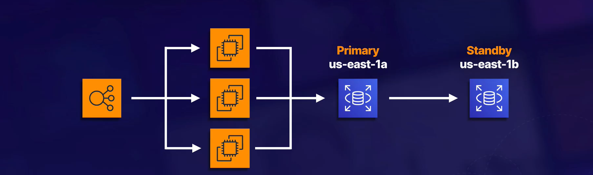

- **AWS handles the replication for us** :- When we write to our production database, this write will uoatically synchronize to the standby database.  

## Which RDS Types can be and cannot be configured as multi-AZ (as we configure)?  
- SQL Server  
- MySql  
- MariaDB  
- Oracle  
- PostgreSQL  

NOTE :- Amazon Arora is always multi AZ

## Unplanned failure or Maintenance 
If we loose our primary database we are going to automatically failover to another Availability zone. 

- In the event of unplanned failure, RDS will automatically fail over to standby during a failure so database operations can resume quickly without administrative intervention.  

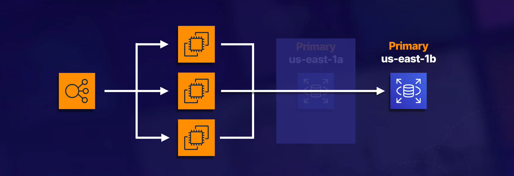  

- Multi-AZ is for disaster recovery, not for improving performance, so you cannot connect to the standby when the primary database is active.  

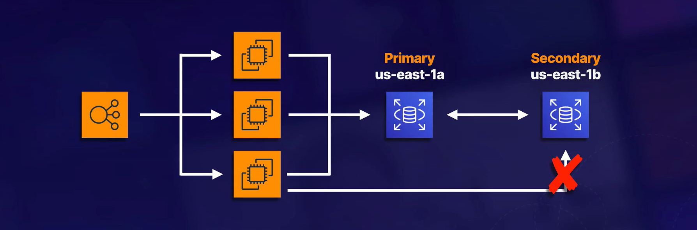

# Create a RDS Instance.  

Step 1 :- Go to RDS console, and click on Databases from left side. then click on creaate Database.

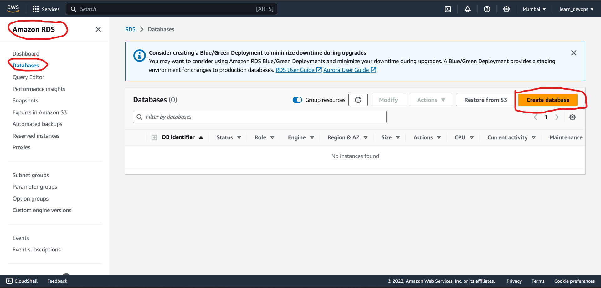  

Step 2 :- click on Standard create and then click oon MySQl or any other database you want to create. 

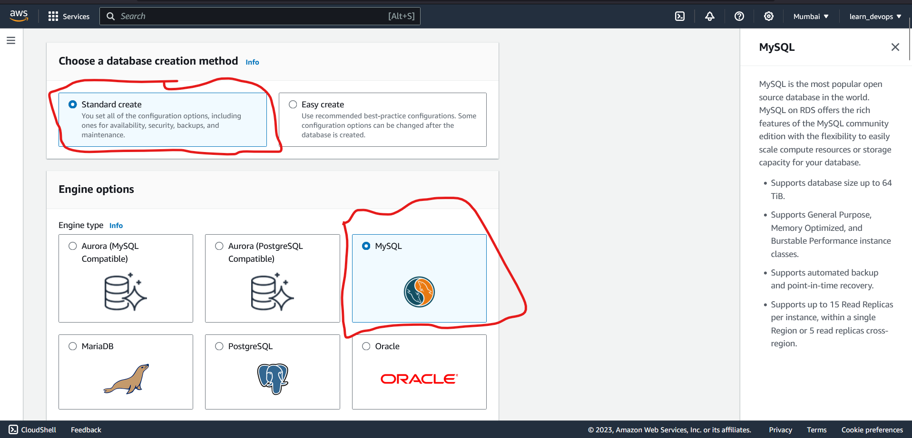  

Step 3 :- Select the Editions version and Engine version and template to use. 

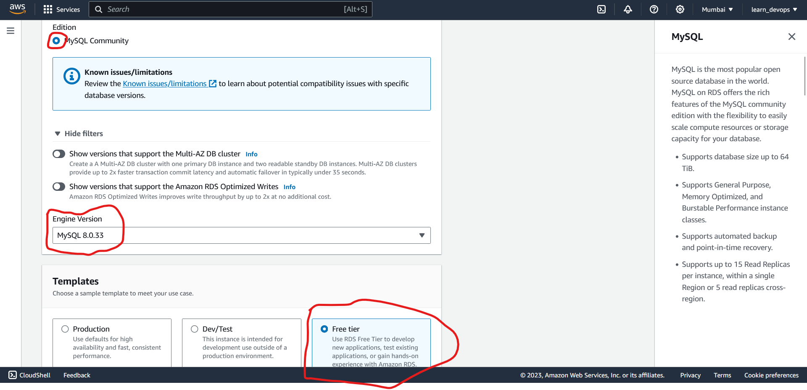

Step 4 :- Provide Database name, Username, and master password 

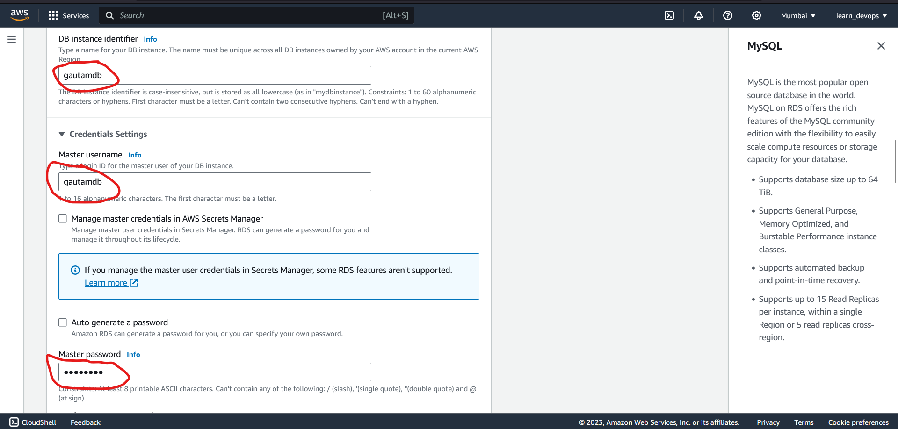

Step 5 :- Select DB instance type and size 
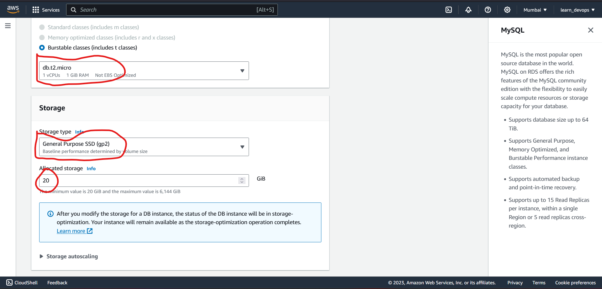  

Step 6 :- Select connectivity option according to your desire  
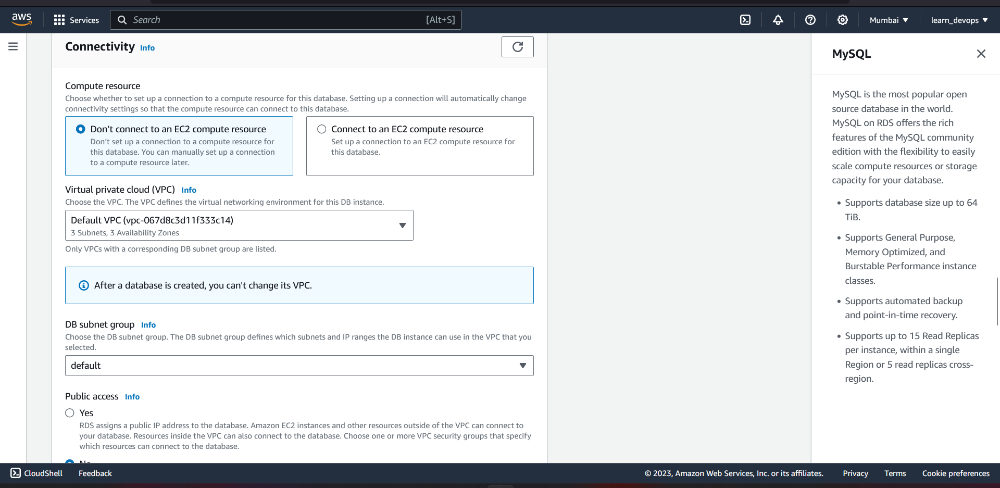  

Step 7 :- Click on create database 
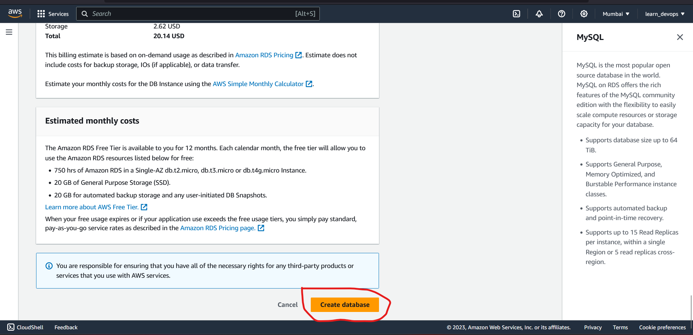  

Your RDS wil be created.

## Endpoint of DB to connect to 

Step 1 :- Click on Database which you want o connect

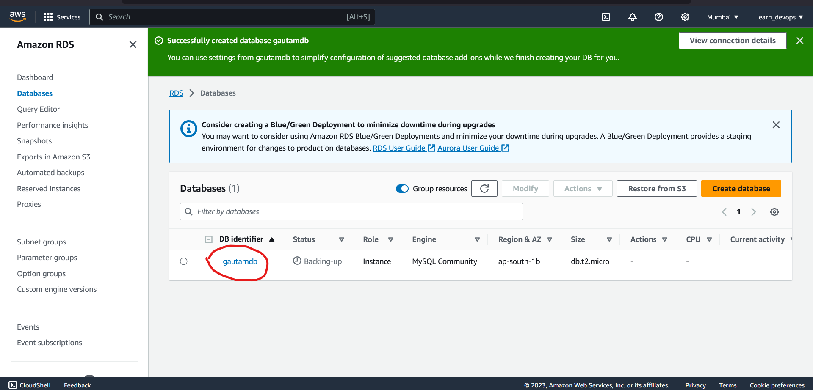  

Step 2 :- In connectivity and security section there will be endpoint and port to connect with this database.  

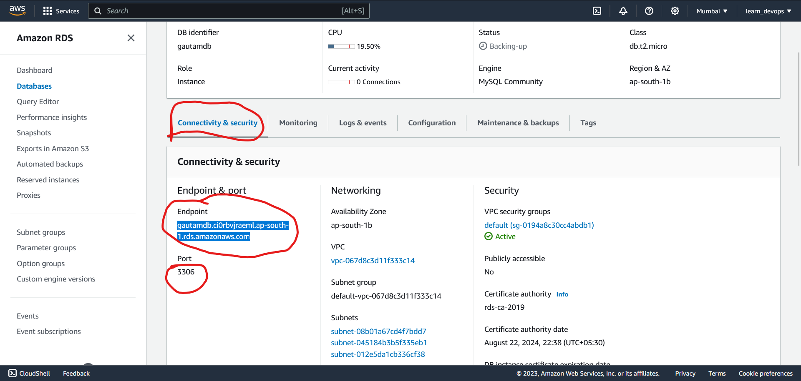  

# Improving Performance of RDS  

## What can I use to improve performane ?  

- Read Replicas 

## What is read Replica?  

A read replica is a read-only copy of our primary database.  

Great for read-heavy workloads and takes the load off your primary database.  

- A read replica ca be cross-AZ or cross-region.  

NOTE: Amazon RDS read replicas complement Multi-AZ deployments. The main purpose of read replicas is scalability, whereas the main purpose for Multi-AZ deployments os availabilty. However, you may use a read replica for disaster recovery of the source DB instance either in the same AWS Region or in another Region. 

- Each read replica has its own DNS endpoint.  

- read replicas can be promoted to be their own databases. This breaks the replication.  

**Key Facts**  
1. Scaling Read Performance :- Primarily used for scaling, not for disaster recovery. 

2. Requires Automatic Backup :- Automatic backups must be enabled in order to deploy a read replicas.  

3. Multiple Read Replicas are supported. MySQL, MariaDB, PostgreSQL, Oracle, and SQL Server allow you to add up to 5 read replicas to each DB instance.  

## How to create read repicas? 
Step 1 :- Select the DB from the list of Databases.  
Step 2 :- Click on Actions, and click on create read replica.  
Step 3 :- Give name to read replica in ``DB instance identifier`` field.  
Step 4 :- Provide other details and click on create read replica. 

We can find access endpoint and port for read replica as same as we found in RDS. 

NOTE :- Read replica is read only copy of database. 

