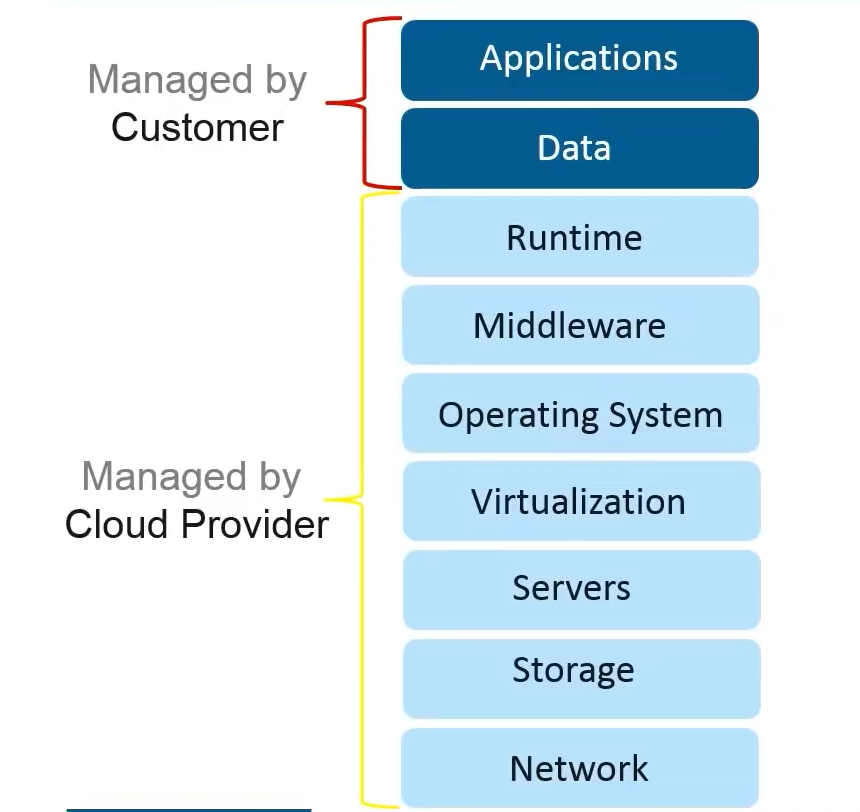

# Elastic Beanstalk 
AWS Elastic Beanstalk is an PAAS (Platform as a Service) used for deploying and scaling web applications and services developed with JAVA, .NET, PHP, Node.js etc on familiar servers such as Apache, Nginx, Tomcat, and IIS. 

## PAAS (Platform as a Service) 

## PAAS Features
- Quicker Development  
- Simplifies Operations  
- Cost Effectiveness  
- Multi-Tenant Architecture  
- Better User Experience 

## Features of Elastic Beanstalk 

1. Elastic Beanstalk is the fastest and simplest way to deploy your application on AWS. 

2. Enables you to focus on writing code rather than spending time anaging and configuring servers etc. 

3. Automatically scales your application up and down based on application's specific needs. 

4. Gives freedom to select the AWS resourcces, like EC2 instance type, that are optimal for your application.  

